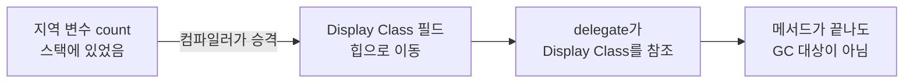

# 클로저 (Closure)

## 핵심 개념

- **클로저**: 함수가 자신이 선언된 위치의 **지역 변수를 기억한 채** 함수 밖으로 빠져나가는 것
- 람다식이나 익명 메서드가 바깥 변수를 참조하면 자동으로 만들어짐
- C#에 `closure`라는 키워드는 없음. 컴파일러가 뒤에서 만들어주는 구조임
- 핵심은 **캡처된 변수의 수명이 늘어난다**는 것. 메서드가 끝나도 변수가 살아있음

```csharp
Func<int> MakeCounter()
{
    int count = 0;              // 지역 변수
    return () => ++count;       // 이 람다가 count를 캡처
}

var counter = MakeCounter();
Console.WriteLine(counter());   // 1
Console.WriteLine(counter());   // 2  ← 메서드가 끝났는데 count가 살아있음
Console.WriteLine(counter());   // 3
```

## 동작 원리

컴파일러가 **Display Class**라는 숨은 클래스를 만들고, 캡처된 지역 변수를 그 클래스의 필드로 옮김(변수 승격, hoisting).



컴파일 후 코드는 대략 이런 모양이 됨.

```csharp
// 컴파일러가 생성 (이름은 실제로 <>c__DisplayClass0_0 같은 형태)
sealed class DisplayClass
{
    public int count;
    public int Lambda() => ++count;
}

Func<int> MakeCounter()
{
    var dc = new DisplayClass();   // 힙 할당
    dc.count = 0;
    return dc.Lambda;              // delegate 할당
}
```

- 지역 변수가 스택이 아니라 **힙에 올라감**
- 그래서 메서드 스택 프레임이 사라져도 값이 유지됨

## 값이 아니라 참조를 캡처함

가장 많이 틀리는 지점.

```csharp
int x = 10;
Action print = () => Console.WriteLine(x);

x = 20;
print();   // 20  ← 10이 아님
```

- 람다를 만든 시점의 **값을 복사**하는 게 아니라 **변수 자체를 공유**함
- Display Class의 같은 필드를 보고 있기 때문

### 반복문에서의 함정

```csharp
var actions = new List<Action>();

for (int i = 0; i < 3; i++)
{
    actions.Add(() => Console.WriteLine(i));
}

foreach (var a in actions) a();   // 3, 3, 3
```

- `for`문의 `i`는 **반복 전체에서 하나뿐인 변수**임
- 세 람다가 같은 변수를 공유하므로 반복이 끝난 뒤의 값(3)을 봄

해결 — 반복마다 새 변수를 만들면 됨.

```csharp
for (int i = 0; i < 3; i++)
{
    int copy = i;                 // 반복마다 새로 생성
    actions.Add(() => Console.WriteLine(copy));
}
// 0, 1, 2
```

`foreach`는 C# 5부터 반복 변수를 매 반복 새로 만들도록 바뀌어 이 문제가 없음.

```csharp
foreach (var item in list)
{
    actions.Add(() => Console.WriteLine(item));   // 안전
}
```

- 주의 — C# 4 이하 코드나 오래된 블로그 예제는 `foreach`도 위험하다고 설명함. 버전 확인 필요

## 할당 비용

| 람다 형태                    | 힙 할당                           |
| ---------------------------- | --------------------------------- |
| 아무것도 캡처하지 않음       | 없음 (컴파일러가 static으로 캐싱) |
| 지역 변수 캡처               | Display Class + delegate          |
| `this`(인스턴스 멤버)만 캡처 | delegate                          |

```csharp
// 캡처 없음 → 최초 1회만 만들고 재사용
list.Where(x => x > 0);

// threshold 캡처 → 호출할 때마다 힙 할당
int threshold = 10;
list.Where(x => x > threshold);
```

- 캡처하지 않는 람다는 컴파일러가 static 필드에 캐싱해서 재사용함
- 캡처하는 순간 캐싱이 불가능해짐. 캡처한 값이 호출마다 다를 수 있기 때문

### static 람다로 실수 방지

C# 9부터 람다 앞에 `static`을 붙이면 캡처를 컴파일 타임에 금지할 수 있음.

```csharp
int threshold = 10;

// ❌ 컴파일 에러: static 람다는 바깥 변수를 캡처할 수 없음
list.Where(static x => x > threshold);

// ✅ 캡처가 없음을 컴파일러가 보장
list.Where(static x => x > 0);
```

- 성능이 중요한 경로에서 실수로 캡처하는 걸 막는 용도로 좋음

## 게임 개발 관점에서

**Update에서의 GC 압박**

- 매 프레임 호출되는 곳에서 캡처 람다를 만들면 프레임마다 힙 할당이 발생함
- 초당 60프레임이면 초당 60번 쓰레기가 쌓임 → GC 스파이크 → 프레임 드랍
- LINQ가 특히 위험함. `Where`, `Select`에 캡처 람다를 넘기면 할당이 겹침

```csharp
// 나쁨 — 매 프레임 할당
void Update()
{
    var near = enemies.Where(e => e.dist < range).ToList();
}

// 좋음 — 미리 만든 리스트에 for문으로 채움
void Update()
{
    nearBuffer.Clear();
    for (int i = 0; i < enemies.Count; i++)
        if (enemies[i].dist < range) nearBuffer.Add(enemies[i]);
}
```

**람다로 구독한 이벤트는 해제할 수 없음**

- 가장 흔한 누수 패턴임

```csharp
// ❌ 해제 불가능
player.OnHpChanged += hp => UpdateBar(hp);

void OnDisable()
{
    player.OnHpChanged -= hp => UpdateBar(hp);   // 다른 인스턴스라 매칭 안 됨
}
```

- `-=`는 delegate의 동등성으로 찾아서 제거하는데, 새로 쓴 람다는 **별개의 인스턴스**임
- 해제하려면 필드에 담아두거나 메서드 그룹을 써야 함

```csharp
// ✅ 메서드로 구독
void OnEnable()  => player.OnHpChanged += UpdateBar;
void OnDisable() => player.OnHpChanged -= UpdateBar;

// ✅ 람다를 써야 한다면 필드에 보관
private Action<int> handler;

void OnEnable()
{
    handler = hp => UpdateBar(hp);
    player.OnHpChanged += handler;
}
void OnDisable() => player.OnHpChanged -= handler;
```

**파괴된 오브젝트를 붙잡는 문제**

- 코루틴, `DOTween` 콜백, 비동기 작업에 넘긴 람다가 `this`를 캡처하면 오브젝트가 Destroy돼도 참조가 남음
- 콜백이 나중에 실행되면서 `MissingReferenceException`이 남
- 대응 — 취소 토큰을 쓰거나 `OnDestroy`에서 콜백을 정리

**UI 버튼 반복 등록**

- 인벤토리 슬롯처럼 반복문으로 버튼을 만들 때 위의 반복 변수 함정이 그대로 나옴
- 슬롯을 눌렀는데 전부 마지막 아이템이 선택되는 버그가 대표적

```csharp
for (int i = 0; i < slots.Count; i++)
{
    int index = i;                                  // 복사 필수
    slots[i].onClick.AddListener(() => Select(index));
}
```

## 의문점 / 더 알아볼 것

- Display Class가 여러 람다에 공유되는 경우 — 한 메서드에 람다가 여러 개면 캡처 변수가 하나의 클래스로 합쳐짐. 의도치 않게 수명이 길어지는 문제
- 구조체 람다와 `ref struct` — 캡처할 수 없는 타입이 있는 이유
- `async`/`await`의 상태 머신과 클로저의 관계 — 둘 다 컴파일러가 클래스를 생성함
- IL2CPP 빌드에서 클로저가 어떤 C++ 코드로 변환되는가
- JavaScript 클로저와의 차이 — `var`/`let`의 스코프 문제가 C# `for`문 함정과 닮은 이유
- `Span<T>`, `stackalloc`처럼 힙 할당을 피하는 방향과 클로저가 충돌하는 지점
