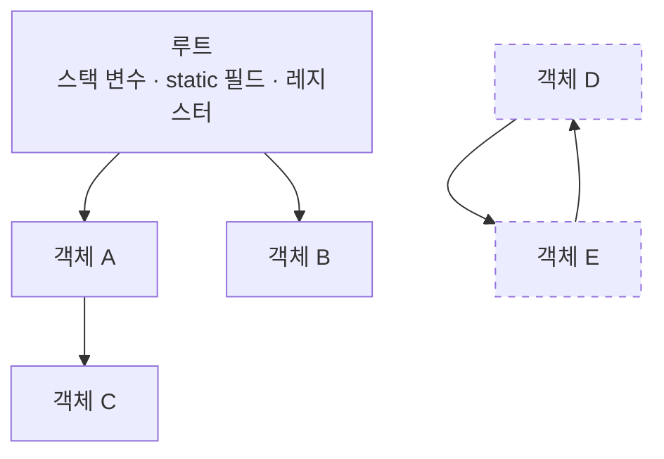

# 가비지 컬렉션 (Garbage Collection, GC)

## 핵심 개념

- **GC**: 더 이상 쓰이지 않는 힙 객체를 런타임이 자동으로 찾아 회수하는 기능
- C++의 `delete`처럼 직접 해제하지 않아도 되므로 메모리 누수와 이중 해제를 막아줌
- 대신 **언제 회수가 일어날지 개발자가 통제할 수 없음**. 게임에서는 이게 문제가 됨
- 대상은 **힙만**임. 스택 변수는 스코프를 벗어나면 그냥 사라지므로 GC와 무관

## 무엇을 쓰레기로 판단하는가

"참조되지 않는 객체"가 아니라 **루트에서 도달할 수 없는 객체**임.

- **루트(Root)** — 스택의 지역 변수, static 필드, CPU 레지스터 등 시작점이 되는 참조
- 루트에서 참조를 따라가며 닿는 객체를 전부 표시(Mark)하고, 표시되지 않은 것을 회수(Sweep)함



- A, B, C는 루트에서 닿으므로 살아남음
- D와 E는 서로를 참조하지만 루트에서 닿을 수 없으므로 **둘 다 회수됨**
- 참조 카운팅 방식과의 결정적 차이임. 순환 참조가 누수로 이어지지 않음

## Mark & Sweep

```
1. Stop the world   모든 관리 스레드를 멈춤
2. Mark             루트에서 출발해 도달 가능한 객체를 표시
3. Sweep            표시되지 않은 객체의 메모리를 회수
4. (Compact)        살아남은 객체를 앞으로 모아 단편화 해소 — 구현에 따라 있고 없음
5. Resume           스레드 재개
```

- 1번과 5번 사이에 게임이 **완전히 멈춤**. 이 시간이 프레임 예산을 넘기면 끊김이 발생함
- 60fps면 한 프레임이 약 16.6ms인데, GC 한 번에 수 ms~수십 ms가 날아갈 수 있음

## .NET GC vs 유니티 GC

둘을 같은 것으로 알고 있으면 최적화 판단이 어긋남.

| 구분          | .NET(CoreCLR) GC | 유니티 기본 GC (Boehm) |
| ------------- | ---------------- | ---------------------- |
| 세대 구분     | 있음 (Gen 0/1/2) | 없음                   |
| 압축(Compact) | 함               | 안 함                  |
| 힙 반환       | OS에 반환함      | 잘 반환하지 않음       |
| 수집 단위     | 세대별 부분 수집 | 전체 힙 스캔           |

**세대별 GC가 없다는 것의 의미**

- .NET은 "대부분의 객체는 금방 죽는다"는 가정으로 Gen 0만 자주 훑어서 비용을 낮춤
- 유니티의 Boehm GC는 그런 구분이 없어 **매번 힙 전체를 훑음**. 힙이 커질수록 수집 시간이 길어짐
- 그래서 유니티에서는 "할당을 줄이는 것"이 .NET보다 훨씬 중요함

**압축을 안 한다는 것의 의미**

- 회수 후에도 빈 공간이 흩어진 채로 남음 → 단편화
- 총 여유 공간이 충분해도 연속된 큰 블록이 없으면 힙을 새로 확장함
- 한 번 늘어난 힙은 줄어들지 않으므로 메모리 사용량이 계단식으로 증가함

**Incremental GC**

- 마크 단계를 여러 프레임에 나눠 수행하는 옵션 (Project Settings에서 설정)
- 한 번에 멈추는 시간이 짧아져 체감 끊김이 줄어듦
- 주의 — 총 작업량이 줄어드는 게 아님. 할당이 많으면 결국 따라잡지 못함

## 할당을 만드는 것들

GC를 줄이려면 먼저 **어디서 할당이 생기는지**를 알아야 함.

| 원인           | 예시                                                      |
| -------------- | --------------------------------------------------------- |
| `new` (클래스) | `new Bullet()` — struct는 스택이라 해당 없음              |
| 박싱           | `object o = 3;`, `int`를 `object` 파라미터에 전달         |
| 문자열 연결    | `"HP: " + hp`, `$"Score {score}"`                         |
| 클로저 캡처    | 지역 변수를 캡처하는 람다                                 |
| LINQ           | `Where`, `Select` — 이터레이터와 델리게이트가 모두 할당됨 |
| 배열 반환 API  | `GetComponents<T>()`, `Physics.RaycastAll()`              |
| 컬렉션 확장    | `List`가 용량을 넘어 내부 배열을 새로 만들 때             |
| `foreach`      | 일부 컬렉션에서 이터레이터가 박싱되는 경우                |

## 측정

- 유니티 Profiler의 **GC Alloc** 열을 봄
- 한 프레임에 0B가 목표. 매 프레임 실행되는 코드에서는 특히
- 추측으로 최적화하지 말 것. 실제로 할당이 일어나는 지점은 예상과 다른 경우가 많음

## 게임 개발 관점에서

**오브젝트 풀링**

- 총알, 이펙트, 적처럼 생성과 파괴가 반복되는 것은 미리 만들어두고 재사용
- `Instantiate`/`Destroy`가 GC의 최대 공급원임
- 이미 정리한 [ObjectPooling] 문서와 직결됨

**struct 활용**

- 값 타입은 스택에 올라가므로 GC 대상이 아님
- 좌표, 데미지 정보처럼 작고 수명이 짧은 데이터에 적합
- 주의 — struct라도 `object`로 넘기거나 컬렉션에 잘못 담으면 박싱되어 오히려 할당이 생김

**문자열**

- UI 텍스트를 매 프레임 갱신하는 코드가 가장 흔한 범인
- 값이 바뀔 때만 갱신하도록 조건을 걸거나 `StringBuilder`를 씀
- 숫자를 문자열로 바꾸는 것 자체가 할당임. 자주 쓰는 값은 미리 캐싱

```csharp
// 나쁨 — 매 프레임 문자열 2개 할당
void Update()
{
    hpText.text = "HP: " + currentHp;
}

// 좋음 — 값이 바뀔 때만
void SetHp(int hp)
{
    if (hp == cachedHp) return;
    cachedHp = hp;
    hpText.text = "HP: " + hp;
}
```

**캐싱**

- `GetComponent`, `Camera.main`, `transform`은 호출 비용이 있으므로 `Awake`에서 받아 필드에 보관
- 배열을 반환하는 API 대신 `NonAlloc` 계열을 씀 (`Physics.RaycastNonAlloc` 등)

**로딩 타이밍에 몰기**

- 씬 전환, 로딩 화면처럼 끊겨도 티가 안 나는 시점에 `GC.Collect()`를 직접 호출하는 기법이 있음
- 전투 중에는 절대 부르면 안 됨. 전체 힙을 훑으므로 확실하게 멈춤

**메모리 누수는 여전히 가능함**

- GC가 있어도 **참조가 남아있으면 회수되지 않음**
- 대표적인 경로 — 해제하지 않은 이벤트 구독, static 컬렉션에 계속 쌓이는 객체, 람다가 붙잡은 `this`
- "GC가 알아서 해준다"가 아니라 "도달 가능하면 절대 안 지운다"로 이해하는 게 정확함

## 의문점 / 더 알아볼 것

- 소멸자(Finalizer)와 `IDisposable`의 차이 — 관리 리소스와 비관리 리소스
- 왜 Finalizer가 있는 객체는 회수가 한 사이클 늦어지는가
- LOH(Large Object Heap) — 큰 배열이 별도로 취급되는 이유
- `GC.Collect()`의 인자들과 `GCSettings.LatencyMode`
- 유니티의 CoreCLR 전환 — 세대별 GC가 도입되면 지금의 최적화 전략 중 무엇이 바뀌는가
- 약한 참조(`WeakReference`) — 캐시에 쓰는 패턴
- `Span<T>`, `stackalloc`, `ArrayPool<T>` — 할당 자체를 피하는 최신 방향
- Rust의 소유권 모델처럼 GC 없이 메모리를 관리하는 방식과의 트레이드오프
