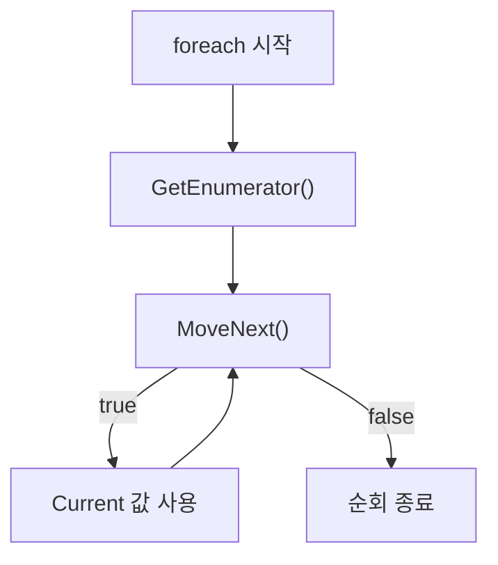

# 이터레이터와 yield return (Iterator & yield return)

## 핵심 개념

- **이터레이터**: 값을 하나씩 순서대로 꺼내주는 객체
- **`yield return`**: 값을 하나 내주고 **그 자리에서 실행을 멈춤**. 다음 호출 때 멈춘 지점부터 이어서 실행함
- 지역 변수와 실행 위치가 보존됨. 일반 메서드처럼 처음부터 다시 시작하지 않음

```csharp
IEnumerable<int> Count()
{
    Console.WriteLine("1 준비");
    yield return 1;          // 여기서 멈춤
    Console.WriteLine("2 준비");
    yield return 2;          // 다시 호출되면 여기서부터
}

foreach (var n in Count()) Console.WriteLine(n);
// 1 준비 → 1 → 2 준비 → 2
```

## IEnumerable과 IEnumerator

| 인터페이스    | 역할                                            | 비유   |
| ------------- | ----------------------------------------------- | ------ |
| `IEnumerable` | 순회할 수 있다는 자격. `GetEnumerator()`만 가짐 | 책     |
| `IEnumerator` | 실제로 순회하는 커서. `MoveNext()`, `Current`   | 책갈피 |

```csharp
public interface IEnumerator
{
    object Current { get; }   // 현재 값
    bool MoveNext();          // 다음으로 이동. 더 없으면 false
    void Reset();
}
```

## foreach의 정체

`foreach`는 문법 설탕이고, 컴파일하면 `MoveNext()` 반복문이 됨.



- 그래서 `IEnumerator`를 직접 구현한 클래스도 `foreach`로 돌릴 수 있음

## 컴파일러가 상태 머신을 만듦

`yield return`이 있는 메서드는 컴파일 시점에 **클래스로 변환됨**.

- 실행 위치를 기억하는 `state` 필드
- 지역 변수를 담는 필드들
- `MoveNext()` 안의 거대한 `switch`문

```csharp
// 개념적인 변환 결과
sealed class Iterator : IEnumerator<int>
{
    int state;
    public int Current { get; private set; }

    public bool MoveNext()
    {
        switch (state)
        {
            case 0: Current = 1; state = 1; return true;
            case 1: Current = 2; state = 2; return true;
            default: return false;
        }
    }
}
```

- [Closure]와 같은 원리임. 둘 다 컴파일러가 숨은 클래스를 만들어 상태를 힙에 보관함
- 그래서 이터레이터를 만들 때마다 **힙 할당이 발생함**

## 지연 실행 (Lazy Evaluation)

이터레이터 메서드는 **호출해도 몸체가 실행되지 않음**. 순회를 시작해야 실행됨.

```csharp
var seq = Count();           // 아무것도 출력되지 않음
foreach (var n in seq) { }   // 이때 비로소 실행
```

- 주의 — 순회할 때마다 처음부터 다시 실행됨. `ToList()`로 고정하지 않으면 같은 쿼리가 여러 번 돎
- LINQ가 전부 이 구조임. `Where`, `Select`를 연결해도 실제 계산은 마지막에 한 번만 일어남

## 무한 시퀀스와 yield break

```csharp
IEnumerable<int> Infinite()
{
    int i = 0;
    while (true) yield return i++;   // 끝이 없어도 됨
}

IEnumerable<int> UpTo(int max)
{
    for (int i = 0; ; i++)
    {
        if (i > max) yield break;    // 순회 종료
        yield return i;
    }
}
```

- 지연 실행이므로 무한 루프를 써도 필요한 만큼만 계산됨

## 게임 개발 관점에서

**코루틴의 기반**

- 유니티 코루틴은 `IEnumerator`를 유니티가 붙잡아두고 매 프레임 `MoveNext()`를 호출하는 구조임
- "멈췄다 이어서 실행"이 곧 "여러 프레임에 걸쳐 실행"이 됨
- 자세한 동작은 [Coroutine] 참고

**할당 비용**

- 이터레이터를 만들 때마다 상태 머신 객체가 힙에 할당됨
- 매 프레임 호출되는 경로에서 이터레이터를 새로 만드는 구조는 나쁨
- LINQ가 무거운 이유도 이터레이터와 델리게이트 할당이 겹치기 때문임

**지연 실행 함정**

- `IEnumerable`을 반환하는 메서드의 결과를 여러 번 순회하면 매번 다시 계산됨
- 결과를 재사용할 거면 `ToList()`, `ToArray()`로 한 번 고정할 것

## 의문점 / 더 알아볼 것

- `yield return`을 `try-catch` 안에 쓸 수 없는 이유
- `IEnumerable`과 `IEnumerator`를 한 클래스가 동시에 구현하면 생기는 문제
- `async`/`await`의 상태 머신과 이터레이터 상태 머신의 공통점
- `yield` 없이 `IEnumerator`를 직접 구현하면 할당을 줄일 수 있는가
- `IEnumerable<T>`와 `IReadOnlyList<T>` 중 무엇을 반환 타입으로 쓸 것인가
