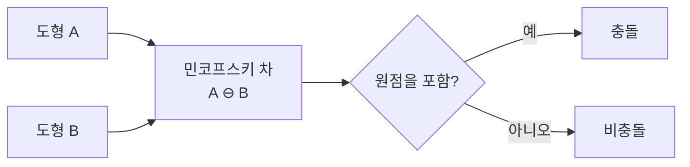

# 민코프스키 합과 차 (Minkowski Sum & Difference)

## 핵심 개념

- **민코프스키 합**: 두 도형의 모든 점을 벡터로 더해 만든 집합
- **민코프스키 차**: 한쪽을 뒤집어(부호 반전) 더한 것. `A ⊖ B = A ⊕ (-B)`
- 충돌 판정에서 중요한 이유는 다음 정리 때문임

```
A와 B가 겹친다  ⟺  A ⊖ B 가 원점을 포함한다
```

- 즉 **"두 도형이 겹치는가"라는 문제를 "한 도형이 원점을 품는가"로 바꿔줌**
- 비교 대상이 둘에서 하나로 줄어들어 계산이 단순해짐

```
A ⊕ B = { a + b | a ∈ A, b ∈ B }
A ⊖ B = { a - b | a ∈ A, b ∈ B }
```

## 왜 원점인가

- `a - b = 0`이 되는 `a`, `b`가 존재한다는 것은 **같은 위치의 점이 양쪽에 있다**는 뜻임
- 같은 점을 공유하면 두 도형은 겹쳐 있음
- 반대로 차집합이 원점을 포함하지 않으면 어떤 점도 겹치지 않음



## 볼록 도형 전제

- 이 성질은 **볼록(convex) 도형에서만** 깔끔하게 성립함
- 볼록 도형의 민코프스키 합은 다시 볼록임. 그래서 재귀적으로 다룰 수 있음
- 오목(concave) 도형은 여러 볼록 조각으로 분해해서 처리함 (Convex Decomposition)

## GJK 알고리즘과의 관계

- 민코프스키 차를 실제로 다 만들면 점의 개수가 폭발함. `A`가 m개, `B`가 n개면 m×n개
- GJK는 **차집합을 만들지 않고** 필요한 점만 그때그때 구해가며 원점 포함 여부를 판정함
- 그 도구가 **서포트 함수(support function)** — "어떤 방향으로 가장 멀리 있는 점"을 반환함
- 서포트 함수만 정의하면 원, 캡슐, 볼록 다면체를 같은 코드로 처리할 수 있음

| 단계 | 하는 일                                                   |
| ---- | --------------------------------------------------------- |
| GJK  | 원점이 민코프스키 차 안에 있는지 판정 (겹치는가)          |
| EPA  | 겹칠 때 침투 깊이와 방향을 구함 (얼마나, 어디로 밀어낼까) |

- 침투 깊이는 **원점에서 차집합 경계까지의 최단 거리**임. 충돌 응답에 이 값이 필요함

## 게임 개발 관점에서

**물리 엔진 내부에서 쓰임**

- Box2D, Bullet, PhysX 등 대부분의 물리 엔진이 GJK/EPA를 씀
- 유니티 Collider의 충돌 판정도 이 계열임. 직접 구현할 일은 드물지만 동작 원리를 알면 Collider 형태 선택의 근거가 됨
- 볼록 도형만 빠르게 처리되므로, Mesh Collider에 Convex 옵션이 있는 이유가 여기 있음

**캐릭터 이동 판정**

- 플레이어를 점으로 줄이고 장애물을 플레이어 크기만큼 부풀리면 같은 문제가 됨
- 이게 민코프스키 합의 대표적 활용임. 경로 계획에서 Configuration Space라 부름
- `Physics.SphereCast`, `CapsuleCast` 같은 캐스트 계열이 개념적으로 이 방식임

**연속 충돌 판정 (CCD)**

- 빠른 총알이 벽을 뚫는 문제(터널링)를 막으려면 이동 궤적 전체를 쓸어낸 볼륨으로 판정해야 함
- 이동 벡터와 도형의 민코프스키 합이 그 스윕 볼륨임

**비용 인식**

- 원 대 원은 거리 비교 한 번으로 끝남. 볼록 다각형끼리는 GJK 반복이 필요함
- Collider를 복잡한 메시로 두면 이 비용이 오브젝트 수만큼 곱해짐
- 브로드 페이즈(AABB, 공간 분할)로 후보를 걸러낸 뒤 좁은 판정에만 GJK를 쓰는 구조가 표준임

## 의문점 / 더 알아볼 것

- 서포트 함수를 도형별로 어떻게 정의하는가 — 원, 캡슐, 볼록 다각형
- GJK의 심플렉스(simplex) 갱신 과정과 종료 조건
- SAT(분리축 정리)와 GJK의 차이 — 어느 쪽이 어떤 상황에 유리한가
- EPA 대신 쓰이는 침투 깊이 근사 기법
- 볼록 분해 알고리즘과 그 결과물의 품질이 성능에 미치는 영향
- 2D에서는 더 단순한 판정으로 충분한 경우가 많은데, 어디서부터 GJK가 필요해지는가
