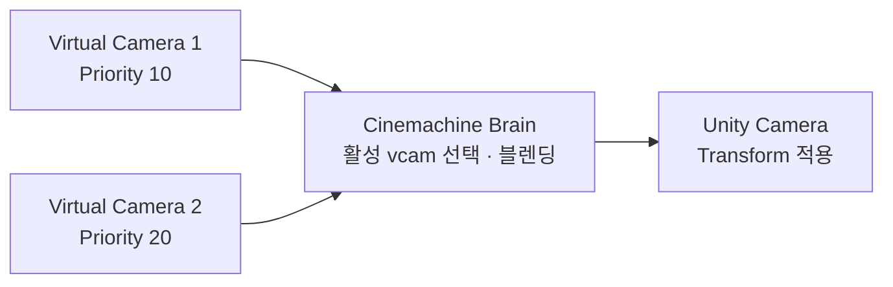

# 시네머신 (Cinemachine)

## 핵심 개념

- **시네머신**: 카메라 동작을 컴포넌트 조합으로 구성하는 유니티 공식 패키지
- 추적, 감쇠, 화면 구도, 전환 블렌딩을 코드 없이 인스펙터에서 설정함
- 핵심 구조는 **Brain 하나 + Virtual Camera 여러 개**임



- **Virtual Camera(vcam)** — 실제 카메라가 아님. "카메라가 어디서 무엇을 어떻게 볼지"에 대한 **설정 묶음**임
- **Cinemachine Brain** — 실제 `Camera`에 붙음. 활성 vcam을 골라 그 설정을 실제 카메라 Transform에 적용함
- 그래서 카메라는 씬에 하나만 있고, vcam을 여러 개 두고 갈아 끼우는 방식이 됨

## 활성 vcam 결정과 전환

- Priority가 가장 높은 vcam이 활성화됨
- 전환 시 Brain의 Blend 설정에 따라 즉시 컷 또는 부드러운 전환이 일어남
- 코드에서 바꿀 때는 Priority를 조정하거나 vcam을 활성/비활성 토글함

```csharp
// 보스전 카메라로 전환
bossCam.Priority = 20;   // 기존 플레이어 카메라보다 높게
```

- 전환 규칙은 Brain의 Custom Blends에서 vcam 쌍별로 따로 지정 가능함

## Body와 Aim

vcam의 동작은 **위치(Body)**와 **회전(Aim)**으로 분리되어 있음. 이 분리가 시네머신 설계의 핵심임.

| 구분 | 역할                 | 주요 옵션                                                                     |
| ---- | -------------------- | ----------------------------------------------------------------------------- |
| Body | 카메라를 어디에 둘지 | Transposer, Framing Transposer, Orbital Transposer, Tracked Dolly, Do Nothing |
| Aim  | 어디를 바라볼지      | Composer, Hard Look At, POV, Do Nothing                                       |

- **Framing Transposer** — 2D에서 주로 씀. 대상을 화면의 특정 위치에 유지함
- **Transposer** — 3D에서 대상 기준 상대 위치를 유지함
- **Orbital Transposer** — 대상 주위를 회전함. 3인칭 시점용
- Body와 Aim을 독립적으로 고를 수 있어 조합이 자유로움

## Dead Zone과 Damping

카메라가 "따라오는 느낌"을 만드는 두 장치임.

- **Dead Zone** — 화면 안에서 대상이 이 영역에 있으면 **카메라를 움직이지 않음**
  - 걷는 중 미세한 떨림이 카메라로 전달되지 않게 함
  - 플랫포머에서 점프할 때마다 화면이 흔들리는 문제의 해결책임
- **Soft Zone** — Dead Zone 밖의 완충 구간. 대상이 여기 들어오면 서서히 따라감
- **Damping** — 따라가는 지연 시간. 값이 클수록 묵직해짐
  - X, Y, Z를 따로 지정할 수 있음. 2D에서 Y만 크게 두면 점프 시 세로 추적이 부드러워짐

## 주요 확장 기능

| 확장                       | 용도                                 |
| -------------------------- | ------------------------------------ |
| Confiner (2D)              | 카메라 이동 범위를 폴리곤으로 제한   |
| Impulse                    | 폭발·타격 시 충격 흔들림             |
| Basic Multi Channel Perlin | 핸드헬드 느낌의 지속적 흔들림        |
| Target Group               | 여러 대상을 한 화면에 담고 자동 줌   |
| Collider                   | 장애물에 카메라가 가려지지 않게 회피 |

- Confiner는 맵 밖의 빈 공간이 보이는 문제를 막음. 2D 프로젝트에서 거의 필수임
- Target Group은 협동 플레이나 보스와 플레이어를 동시에 담을 때 씀

## 게임 개발 관점에서

**2D 플랫포머 기본 조합**

- Body: Framing Transposer / Aim: Do Nothing
- Dead Zone으로 미세 흔들림 제거, Y축 Damping을 X축보다 크게
- Confiner로 맵 경계 제한

**직접 구현 대비**

- 카메라 추적 자체는 `Vector3.Lerp` 몇 줄이면 됨
- 하지만 데드존, 축별 감쇠, 경계 제한, 전환 블렌딩까지 붙이면 코드가 상당히 불어남
- 시네머신을 쓰면 그 부분을 인스펙터에서 조정할 수 있어 **감을 잡는 반복이 빨라짐**. 카메라는 수치를 만져보며 맞춰야 하는 영역이라 이 이점이 큼

**Update Method 주의**

- Brain의 Update Method 설정에 따라 지터가 생길 수 있음
- 대상이 Rigidbody로 움직이면 `Fixed Update`나 `Smart Update`가 맞음
- Transform으로 직접 움직이면 `Late Update`
- 카메라가 미세하게 떠는 현상은 이 설정 불일치가 흔한 원인임

**주의할 점**

- vcam은 실제 카메라가 아니므로 `Camera.main`으로 vcam을 찾으려 하면 안 됨
- Brain이 없으면 vcam은 아무 일도 하지 않음
- 여러 vcam이 같은 Priority면 어느 것이 활성화될지 예측하기 어려움. 값을 명시적으로 벌려둘 것

## 의문점 / 더 알아볼 것

- Cinemachine 3.x에서 바뀐 클래스 이름과 구조 (2.x의 `CinemachineVirtualCamera` 대응)
- Impulse와 Perlin Noise의 차이 — 일회성 충격과 지속적 흔들림
- Timeline과 연동한 컷신 카메라 제어 방식
- vcam이 많아질 때의 성능 비용 — 비활성 vcam도 계산되는가
- 픽셀아트 프로젝트에서 시네머신과 Pixel Perfect Camera를 함께 쓸 때의 문제
- 커스텀 Extension을 만들어 카메라 동작을 확장하는 방법
