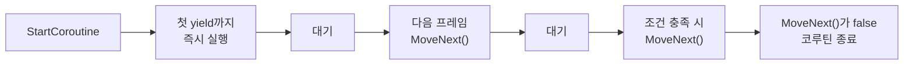

# 코루틴 (Coroutine)

## 핵심 개념

- **코루틴**: 실행을 여러 프레임에 나눠 수행하는 유니티의 기능
- `StartCoroutine`에 넘기는 것은 `IEnumerator`임. 유니티가 이것을 붙잡아두고 **매 프레임 `MoveNext()`를 호출함**
- `yield`로 멈췄다 이어지는 이터레이터의 성질을 그대로 활용한 구조.

```csharp
IEnumerator FadeOut()
{
    float t = 0f;
    while (t < 1f)
    {
        t += Time.deltaTime;
        SetAlpha(1f - t);
        yield return null;      // 다음 프레임까지 대기
    }
}

StartCoroutine(FadeOut());
```

## 실행 흐름



- 주의 — `StartCoroutine` 호출 시점에 **첫 `yield`까지는 즉시 실행됨**. 다음 프레임부터가 아님
- 초기화 코드를 첫 `yield` 위에 두면 동기적으로 실행된다는 뜻임

## yield 대상별 동작

| 코드                                         | 재개 시점                    |
| -------------------------------------------- | ---------------------------- |
| `yield return null`                          | 다음 프레임                  |
| `yield return new WaitForSeconds(t)`         | t초 뒤 (timeScale 영향 받음) |
| `yield return new WaitForSecondsRealtime(t)` | t초 뒤 (timeScale 무시)      |
| `yield return new WaitForFixedUpdate()`      | 다음 FixedUpdate 뒤          |
| `yield return new WaitForEndOfFrame()`       | 렌더링 완료 뒤               |
| `yield return new WaitUntil(() => cond)`     | 조건이 참이 될 때            |
| `yield return StartCoroutine(Other())`       | 다른 코루틴이 끝날 때까지    |

- `WaitForSeconds`는 `timeScale`을 따름. 일시정지(`timeScale = 0`) 중에는 영원히 안 끝남
- 일시정지 UI 연출에는 `WaitForSecondsRealtime`을 써야 함

## GC 함정

```csharp
// 나쁨 — 반복마다 힙 할당
while (true)
{
    yield return new WaitForSeconds(1f);
    Fire();
}

// 좋음 — 한 번 만들어 재사용
private readonly WaitForSeconds wait = new WaitForSeconds(1f);

while (true)
{
    yield return wait;
    Fire();
}
```

- `yield return 0`도 피할 것. `int`가 `object`로 박싱되어 할당이 생김. 같은 의미면 `yield return null`
- 코루틴 자체도 시작할 때마다 상태 머신 객체가 할당됨. 매 프레임 `StartCoroutine`을 부르는 구조는 나쁨
- `WaitUntil`은 람다를 받으므로 캡처가 있으면 [Closure] 할당이 추가로 생김

## 코루틴은 스레드가 아님

- 전부 메인 스레드에서 실행됨. 병렬 처리가 아니라 **실행을 쪼개는 것**임
- 코루틴 안에서 무거운 연산을 하면 그 프레임이 그대로 멈춤
- 진짜 병렬이 필요하면 `Task`나 Job System을 써야 함

## 생명주기 주의

- `GameObject`가 비활성화되면 코루틴이 멈추고, 다시 켜도 **이어지지 않음**
- `Destroy`되면 코루틴도 함께 사라짐
- 컴포넌트만 비활성화(`enabled = false`)한 경우에는 계속 실행됨. 오브젝트 비활성화와 다름

**정확히 멈추려면 핸들을 보관할 것**

```csharp
private Coroutine running;

void Begin()
{
    if (running != null) StopCoroutine(running);
    running = StartCoroutine(Routine());
}
```

- `StopCoroutine`에 메서드 이름을 문자열로 넘기는 방식은 오타에 취약하고 느림
- `StopAllCoroutines()`는 해당 MonoBehaviour의 모든 코루틴을 멈추므로 범위를 확인하고 쓸 것

## 게임 개발 관점에서

**적합한 용도**

- 페이드 인/아웃, 이동 연출 등 여러 프레임에 걸친 애니메이션
- 일정 시간 간격으로 반복되는 동작 (스폰, 공격 쿨다운)
- 순차적으로 진행되는 연출 (컷신, 튜토리얼 단계)
- 로딩처럼 한 프레임에 끝내면 멈춤이 생기는 작업을 나눠 처리

**적합하지 않은 용도**

- 매 프레임 조건만 검사하는 단순 로직 — `Update`가 더 단순하고 할당도 없음
- 반환값이 필요한 비동기 작업 — 코루틴은 값을 돌려줄 수 없음
- 무거운 연산 — 메인 스레드를 막으므로 프레임이 그대로 날아감

**대안**

- `async`/`await` — 반환값을 받을 수 있고 예외 처리도 가능함. 다만 유니티 생명주기와 맞물리지 않아 오브젝트 파괴 후에도 계속 실행될 위험이 있음
- UniTask — 할당이 거의 없고 유니티 생명주기와 연동됨. 실무에서 많이 씀

## 의문점 / 더 알아볼 것

- `CustomYieldInstruction` — 직접 대기 조건을 만드는 방법
- 코루틴이 실행되는 정확한 시점 — `Update` 이후, `LateUpdate` 이전인가
- `WaitForEndOfFrame`을 스크린샷 캡처에 쓰는 이유
- UniTask가 할당 없이 동작하는 원리
- 코루틴 대신 `Update` + 타이머 변수로 구현했을 때의 성능 차이
- 코루틴을 MonoBehaviour 없이 실행하는 방법이 있는가
