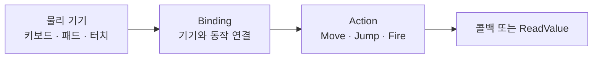

# 인풋 시스템 (Input System)

## 핵심 개념

- **Input System**: 기존 `Input.GetKey` 방식(레거시 Input Manager)을 대체하는 유니티 공식 입력 패키지
- 핵심 발상은 **기기와 동작을 분리하는 것**임
- 코드는 "점프 동작이 발생했다"만 알고, 그것이 스페이스바인지 패드 A버튼인지는 설정에서 정함



## 레거시 방식의 문제

- 기기가 코드에 하드코딩됨. 패드를 지원하려면 코드를 고쳐야 함
- 매 프레임 폴링해야 함. 입력을 놓치거나 중복 처리되는 경우가 생김
- 키 리바인딩을 구현하기 어려움
- 로컬 멀티플레이어에서 어느 기기가 누른 것인지 구분하기 번거로움

## 구조

| 계층 | 역할 |
| --- | --- |
| Input Actions (에셋) | 입력 설정 전체를 담는 파일 |
| Action Map | 상황별 묶음. `Player`, `UI`, `Vehicle` 등 |
| Action | 하나의 동작. `Move`, `Jump`, `Fire` |
| Binding | Action에 연결된 실제 입력. `<Keyboard>/space` |

- Action Map을 나누는 것이 중요함. 메뉴를 열면 `Player`를 끄고 `UI`만 켜면 됨

## Action Type

| 타입 | 용도 |
| --- | --- |
| Value | 연속적인 값. 이동 입력, 마우스 위치 |
| Button | 눌림/떼짐. 점프, 발사 |
| Pass Through | 필터 없이 모든 변화를 전달 |

- WASD 네 개를 묶어 `Vector2`로 만드는 것은 **Composite Binding (2D Vector)**으로 설정함

## 읽는 방법

**1. PlayerInput 컴포넌트 + 이벤트**

- 인스펙터에서 Action과 메서드를 연결함. 코드가 적고 빠르게 붙일 수 있음

```csharp
public void OnMove(InputAction.CallbackContext ctx)
{
    moveInput = ctx.ReadValue<Vector2>();
}
```

**2. 생성된 C# 클래스**

- Input Actions 에셋에서 `Generate C# Class`를 체크하면 래퍼 클래스가 만들어짐
- 문자열 대신 프로퍼티로 접근하므로 오타가 컴파일 에러로 잡힘

```csharp
private PlayerControls controls;

void Awake()
{
    controls = new PlayerControls();
    controls.Player.Jump.performed += OnJump;
}

void OnEnable()  => controls.Enable();
void OnDisable() => controls.Disable();   // 반드시 쌍으로
```

**3. 직접 폴링**

```csharp
Vector2 move = moveAction.ReadValue<Vector2>();
```

- 매 프레임 현재 값만 필요할 때 간단함

## 콜백 단계

| 단계 | 시점 |
| --- | --- |
| started | 입력이 시작됨 |
| performed | 조건이 충족되어 동작이 발생함 |
| canceled | 입력이 끝나거나 취소됨 |

- 대부분 `performed`만 쓰면 됨
- 꾹 누르기(Hold), 연타(MultiTap) 같은 Interaction을 붙이면 단계 구분이 의미를 가짐

## 게임 개발 관점에서

**Enable을 잊으면 아무 일도 일어나지 않음**

- Action은 활성화해야 동작함. `PlayerInput` 컴포넌트를 쓰면 자동이지만, 직접 생성했다면 `Enable()`을 불러야 함
- 가장 흔한 "입력이 안 먹는다" 원인임

**구독 해제 필요**

- `performed += ...`는 이벤트 구독임. 해제하지 않으면 누수가 생김
- 람다로 구독하면 해제할 수 없음. [[Closure]]와 [[Event & Pub-Sub Pattern]]의 문제가 그대로 적용됨
- `OnEnable`/`OnDisable`에 `+=`와 `-=`를 쌍으로 둘 것

**리바인딩이 쉬워짐**

- `PerformInteractiveRebinding()`으로 "키를 입력하세요" UI를 구현할 수 있음
- 결과를 JSON으로 저장해 설정으로 보관함
- 레거시 방식에서는 직접 만들어야 했던 기능임

**기기 자동 전환**

- Control Scheme을 설정하면 키보드로 조작하다 패드를 잡는 순간 자동으로 바뀜
- UI 아이콘을 현재 기기에 맞춰 바꾸는 처리에 활용됨

**로컬 멀티플레이어**

- `PlayerInputManager`가 기기별로 플레이어를 자동 생성하고 입력을 분리해줌
- 레거시 방식에서 가장 번거로웠던 부분이 패키지 기능으로 해결됨

**주의할 점**

- 레거시와 동시에 쓰려면 Project Settings의 Active Input Handling을 `Both`로 둘 것
- 기본값은 새 시스템만 활성이라 기존 `Input.GetKey` 코드가 예외를 던짐

## 의문점 / 더 알아볼 것

- Processors — Invert, Normalize, Deadzone을 바인딩 단계에서 처리하는 방법
- Interactions — Hold, Tap, SlowTap, MultiTap의 판정 기준
- `InputSystem.onAnyButtonPress` 같은 저수준 API의 쓸모
- 입력 버퍼링 — 격투 게임식 선입력을 구현하는 방법
- 터치와 제스처 처리 — Enhanced Touch API
- 입력 기록/재생(Input Recording)을 리플레이 기능에 활용할 수 있는가