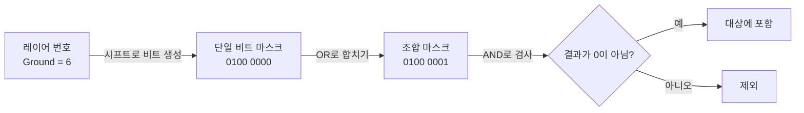

# 레이어마스크 (LayerMask)

## 핵심 개념

- **레이어**: 게임 오브젝트를 분류하는 번호. 0~31까지 **32개**가 있음
- **레이어마스크**: "어떤 레이어들을 대상으로 할지"를 **하나의 `int`에 비트로 담은 것**
- 레이캐스트, 충돌 판정, 카메라 컬링처럼 "이 레이어들만 신경 써라"가 필요한 곳에 쓰임
- 핵심은 **레이어 번호와 레이어마스크는 다른 값**이라는 점임. 이걸 섞으면 버그가 남

| 구분 | 의미 | 예시 |
| --- | --- | --- |
| 레이어 번호 | 0~31 중 하나 | `gameObject.layer = 6` |
| 레이어마스크 | 32비트 중 켜진 비트들의 집합 | `0b0100_0001` = 0번 + 6번 |

## 비트로 집합을 표현함

`int`의 32비트 각각이 레이어 하나에 대응함. 비트가 1이면 포함, 0이면 제외.

```
레이어 번호   31 ...  8  7  6  5  4  3  2  1  0
비트           0 ...  0  0  1  0  0  0  0  0  1
                            ↑                 ↑
                         Ground(6)       Default(0)

→ 이 마스크 하나가 "Default와 Ground"라는 집합을 뜻함
```

- 레이어를 몇 개 고르든 **항상 `int` 하나(4바이트)**로 끝남
- 32개라는 상한이 여기서 나옴. `int`가 32비트이기 때문임

## 시프트 연산의 역할

`1 << n`은 **n번째 비트 하나만 켜진 값**을 만듦. 레이어 번호를 마스크로 바꾸는 변환임.

```csharp
1 << 0  // 0000 0001  → Default
1 << 6  // 0100 0000  → Ground
```



- 주의 — **시프트 자체가 장점의 핵심은 아님**. 시프트는 "몇 번 비트인가"를 가리키는 수단일 뿐임
- 진짜 이점은 **집합을 비트로 표현하면 집합 연산이 CPU 명령 하나로 끝난다**는 데 있음

## 왜 비트마스크인가

리스트로 레이어 목록을 들고 있는 방식과 비교하면 차이가 분명함.

| 작업 | `List<int>` 방식 | 비트마스크 |
| --- | --- | --- |
| 포함 여부 검사 | 리스트 순회 O(n) | `mask & (1 << layer)` 한 번 |
| 합집합 | 두 리스트 병합 | `a \| b` |
| 교집합 | 이중 순회 | `a & b` |
| 여집합 (제외) | 전체에서 빼기 | `~a` |
| 메모리 | 레이어 수 × 4바이트 + 힙 할당 | 항상 4바이트, 할당 없음 |

**검사 횟수가 압도적으로 많기 때문임**

- 레이캐스트 한 번에도 물리 엔진은 후보 콜라이더마다 "이 레이어가 마스크에 있나"를 확인함
- 콜라이더가 수천 개면 이 검사가 프레임마다 수천~수만 번 일어남
- 이 검사가 AND 한 번, 분기 없이 끝나야 감당이 됨

**할당이 없음**

- `LayerMask`는 `int`를 감싼 구조체라 값으로 전달되고 힙을 쓰지 않음
- 매 프레임 레이캐스트에 넘겨도 [[GC]] 부담이 없음

**충돌 행렬도 같은 원리임**

- Project Settings의 Layer Collision Matrix는 32×32 체크박스임
- 개념적으로 각 레이어가 "충돌하는 상대 레이어들"을 마스크 하나로 가짐
- 두 콜라이더가 충돌할지 판단할 때 `matrix[A] & (1 << B)` 한 번이면 됨

## 자주 쓰는 연산

```csharp
int ground = LayerMask.NameToLayer("Ground");   // 이름 → 번호 (6)
int enemy  = LayerMask.NameToLayer("Enemy");

// 마스크 만들기
int mask = (1 << ground) | (1 << enemy);         // Ground + Enemy
int mask2 = LayerMask.GetMask("Ground", "Enemy"); // 같은 결과, 이름으로

// 제외하기 — Player만 빼고 전부
int notPlayer = ~(1 << LayerMask.NameToLayer("Player"));

// 포함 여부 검사
bool isTarget = (mask & (1 << other.layer)) != 0;

// 추가 / 제거
mask |=  (1 << enemy);    // Enemy 추가
mask &= ~(1 << enemy);    // Enemy 제거
```

## 가장 흔한 버그 — 번호를 마스크 자리에 넣음

```csharp
int groundLayer = LayerMask.NameToLayer("Ground");   // 6

// ❌ 6을 마스크로 해석하면 0b110 → 레이어 1번과 2번
Physics.Raycast(origin, dir, out hit, 10f, groundLayer);

// ✅ 번호를 마스크로 변환해서 넘겨야 함
Physics.Raycast(origin, dir, out hit, 10f, 1 << groundLayer);
```

- 컴파일 에러가 나지 않음. 둘 다 `int`라서 그냥 엉뚱한 레이어를 검사함
- "레이캐스트가 바닥을 못 찾는다"의 대표 원인임
- 반대로 `gameObject.layer`에 마스크를 넣는 실수도 있음. `layer`는 **번호**를 받음

## 게임 개발 관점에서

**인스펙터로 받는 것이 가장 안전함**

```csharp
[SerializeField] private LayerMask groundMask;   // 인스펙터에 체크박스 드롭다운

void CheckGround()
{
    bool grounded = Physics2D.Raycast(transform.position, Vector2.down, 0.1f, groundMask);
}
```

- 문자열 오타, 번호/마스크 혼동이 원천 차단됨
- 레이어 구성을 바꿔도 코드를 고칠 필요가 없음

**레이어 설계는 초기에 정할 것**

- 32개 중 유니티가 일부를 기본으로 씀 (Default, TransparentFX, Ignore Raycast, Water, UI)
- 실제로 쓸 수 있는 칸은 생각보다 적음
- 용도를 섞으면 금방 부족해짐. 물리용 레이어와 렌더링 구분을 같은 레이어로 처리하려 하면 꼬임
- 렌더링 구분은 URP/HDRP의 Rendering Layer Mask를 별도로 쓸 수 있음

**물리 비용을 줄이는 수단임**

- Layer Collision Matrix에서 서로 충돌할 필요 없는 조합을 끄면 판정 자체가 줄어듦
- 총알끼리, 이펙트와 배경처럼 무의미한 조합을 꺼두는 것만으로 물리 비용이 내려감
- 레이캐스트에도 마스크를 좁혀서 넘길 것. 마스크를 생략하면 거의 모든 레이어를 검사함

**레이어와 태그의 차이**

- 태그는 "이게 무엇인가"를 문자열로 구분함. 집합 연산이 안 됨
- 레이어는 물리·렌더링 시스템이 직접 읽는 필터임
- 엔진이 걸러줘야 하는 구분이면 레이어, 코드에서 판별만 하면 되면 태그

## 의문점 / 더 알아볼 것

- C# `[Flags]` 열거형 — 직접 만드는 비트마스크. 상태 이상, 아이템 속성에 응용
- 비트 연산의 우선순위 함정 — `mask & 1 << layer != 0`이 의도대로 동작하지 않는 이유
- 64개 이상의 분류가 필요할 때의 방법 — `long`, 비트 배열, 다중 마스크
- `Physics.DefaultRaycastLayers`, `IgnoreRaycastLayer`의 실제 값
- 카메라 Culling Mask와 레이어 — 미니맵 카메라에 특정 오브젝트만 그리는 방법
- 물리 엔진이 브로드 페이즈에서 레이어 필터를 언제 적용하는가
- 비트 연산이 분기 없이(branchless) 실행되는 것이 CPU 파이프라인에 유리한 이유