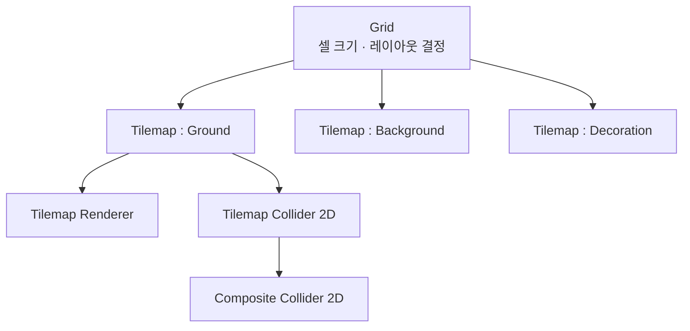

# 타일맵 (Tilemap)

## 핵심 개념

- **타일맵**: 격자(그리드)에 타일을 배치해 2D 레벨을 구성하는 시스템
- 스프라이트를 하나하나 배치하는 대신 **셀 단위로 찍어서** 맵을 만듦
- 내부적으로 타일을 청크 단위 메시로 합쳐서 그리므로, 같은 수의 [[Sprite Renderer]]보다 훨씬 빠름
- 레벨 데이터가 에셋으로 저장되어 버전 관리와 재편집이 쉬움

## 구조



- **Grid** — 부모 오브젝트. 셀 크기와 격자 형태를 정함
- **Tilemap** — 어느 셀에 어떤 타일이 있는지를 담는 컴포넌트
- **Tilemap Renderer** — 타일맵을 화면에 그림
- 하나의 Grid 아래에 Tilemap을 여러 개 두는 것이 기본 구성임

## 레이어 분리

- 용도별로 Tilemap을 나눠야 관리가 됨

| 레이어     | 역할                             |
| ---------- | -------------------------------- |
| Background | 먼 배경. 충돌 없음               |
| Ground     | 지형. 충돌 있음                  |
| Platform   | 통과 가능한 발판. 별도 물리 처리 |
| Decoration | 장식물. 충돌 없음, 앞쪽에 렌더   |

- 충돌 여부가 다르면 반드시 분리할 것. 한 타일맵에 섞으면 콜라이더를 선택적으로 켤 수 없음
- 앞뒤 순서는 Tilemap Renderer의 Sorting Layer와 Order in Layer로 정함

## 타일 에셋

- 스프라이트를 그대로 쓰는 것이 아니라 **Tile 에셋으로 변환**해서 팔레트에 등록함
- Tile Palette 창에서 스프라이트를 드래그하면 자동 생성됨

| 종류            | 설명                                   |
| --------------- | -------------------------------------- |
| Tile            | 기본. 스프라이트 하나                  |
| Animated Tile   | 여러 스프라이트를 순환 재생 (물, 용암) |
| Rule Tile       | 주변 타일 상태를 보고 모양을 자동 선택 |
| Scriptable Tile | `TileBase`를 상속해 직접 구현          |

**Rule Tile이 핵심 생산성 도구임**

- "위에 타일이 없으면 풀이 난 윗면, 양옆에 타일이 있으면 가운데" 같은 규칙을 등록함
- 맵을 그리면 모서리와 이음새가 자동으로 맞춰짐
- 손으로 모서리 타일을 골라 찍는 작업이 사라짐

## 그리드 종류

| 종류             | 용도                     |
| ---------------- | ------------------------ |
| Rectangle        | 일반 2D 플랫포머, 탑다운 |
| Hexagonal        | 육각 타일 전략 게임      |
| Isometric        | 쿼터뷰                   |
| Isometric Z as Y | 쿼터뷰에서 높이 표현     |

- 중간에 바꾸면 기존 타일 배치가 깨지므로 초기에 정할 것

## 콜라이더

**Tilemap Collider 2D만 쓰면 문제가 생김**

- 타일마다 개별 콜라이더가 만들어짐
- 평평한 바닥을 달릴 때 타일 **이음새에 걸려 캐릭터가 튀거나 멈추는 현상**이 발생함 (고스트 충돌)
- 콜라이더 개수도 타일 수만큼 늘어나 물리 비용이 커짐

**Composite Collider 2D로 해결함**

```
1. Tilemap에 Tilemap Collider 2D 추가
2. 같은 오브젝트에 Composite Collider 2D 추가
3. Tilemap Collider 2D의 Used By Composite 체크
4. Rigidbody 2D 추가 (Body Type: Static)
```

- 인접한 타일 콜라이더들이 하나의 외곽선으로 병합됨
- 이음새가 사라지고 콜라이더 개수도 크게 줄어듦
- 2D 타일맵 프로젝트에서 사실상 필수 구성임

## 코드에서 다루기

```csharp
public Tilemap tilemap;

// 월드 좌표 → 셀 좌표
Vector3Int cell = tilemap.WorldToCell(worldPos);

// 타일 조회 / 설정
TileBase tile = tilemap.GetTile(cell);
tilemap.SetTile(cell, someTile);

// 셀 좌표 → 월드 좌표 (셀의 중심은 + 0.5 보정 필요)
Vector3 world = tilemap.GetCellCenterWorld(cell);
```

- 대량 변경은 `SetTile`을 반복하지 말고 `SetTilesBlock`을 쓸 것. 매번 메시를 다시 만들지 않아 훨씬 빠름
- 절차적 생성이라면 배열을 먼저 채우고 한 번에 넘기는 구조로 짤 것
- `CompressBounds`로 빈 영역을 정리하면 순회 범위가 줄어듦

## 게임 개발 관점에서

**셀 크기와 PPU를 맞출 것**

- Grid의 Cell Size는 기본 1 유닛임
- 16×16 픽셀 타일을 쓰면 [[Sprite]]의 Pixels Per Unit도 16으로 맞춰야 타일이 셀에 정확히 들어감
- PPU가 100인 상태로 16px 타일을 넣으면 타일 사이에 틈이 생기거나 겹침

**타일 사이 틈(seam) 문제**

- 타일 경계에 얇은 선이 보이는 현상
- 원인은 텍스처 필터링과 압축. [[Texture]]의 Filter Mode를 `Point`, Compression을 `None`으로 두면 대부분 해결됨
- 타일을 하나의 [[Sprite Atlas]]로 묶을 때는 패딩을 넉넉히 줄 것

**렌더 모드**

- Tilemap Renderer의 Mode가 `Chunk`면 청크 단위로 배칭되어 빠름
- `Individual`은 타일별로 정렬할 수 있지만 [[Draw Call]]이 늘어남
- 캐릭터가 타일 사이에 끼어 보여야 하는 경우에만 `Individual`을 고려할 것

**타일맵을 쓰지 않는 편이 나은 경우**

- 지형이 격자에 맞지 않는 자유 곡선 형태
- 오브젝트마다 개별 로직이 필요한 경우 (타일은 개별 스크립트를 붙일 수 없음)
- 상호작용이 필요한 것은 타일맵에서 빼고 일반 오브젝트로 둘 것

## 의문점 / 더 알아볼 것

- Rule Tile의 규칙 우선순위와 커스텀 Rule Tile 작성법
- Tilemap 데이터가 씬 파일에 저장되는 방식과 용량 문제
- 런타임에 타일맵을 대량 수정할 때 콜라이더 재생성 비용
- Composite Collider 2D의 Geometry Type — Outlines와 Polygons의 차이
- 타일맵과 A\* 길찾기 연동 — 셀 좌표를 그래프 노드로 쓰는 방법
- 무한 맵이나 큰 맵에서 타일맵을 청크 단위로 로드/언로드하는 기법
- Isometric 타일맵의 렌더 정렬 문제와 해결 방식
